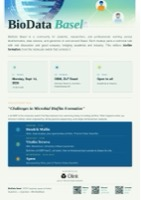
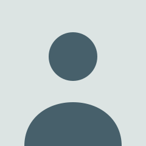

::: {.site-nav}
[BIODATA BASEL](#top){.site-mark}

<nav>[about](#about) [next event](#next-event) [past events](#past-events) [sponsors](#sponsors)</nav>
:::

:::: {#top .hero}
::: {.hero-banner}
{.hero-banner-img alt="DNA helix and community network illustration"}

&gt;&gt; basel, switzerland

:::

::: {.hero-text}
# Basel's **biology** and *data*, innovating together.

A community for data scientists, bioinformaticians, and computational biologists in Basel, with talks, demos, networking, and an apéro.

[see the next event →](#next-event){.btn-cta}
:::
::::

020kb40kb60kb80kb100kb

::: {.content-block}

## About {#about}

Welcome to the official home of the **BioData Basel community**, open to students, researchers, and professionals working in bioinformatics, data science, and genomics across the Basel area. We meet regularly to network, learn from each other, and explore what's new in BioData, in a relaxed setting, over talks and an apéro.

connect

Follow along, or catch the next event as soon as it's announced.

<a href="https://www.linkedin.com/groups/11810024/" class="chip-link" target="_blank" rel="noopener">LinkedIn →</a> <a href="https://www.meetup.com/biodata-basel/" class="chip-link" target="_blank" rel="noopener">Meetup →</a> <a href="https://discord.gg/Weykuj5kHa" class="chip-link" target="_blank" rel="noopener">Discord →</a>

host an apéro

We like to move around in Basel; if your organization wants to host us, we'd love to hear from you.

<a href="mailto:flavio.lombardo@pm.me?subject=BioData%20Basel%20Community%20Hosting" class="chip-link">get in touch →</a>

## Next event {#next-event}

06 Challenges in Microbial Biofilm Formation

with the support of

part of Thermo Fisher Scientific

<dl class="protocol-meta">

<dt>date</dt><dd>2026-09-14, 17:30-19:30</dd>

<dt>venue</dt><dd>Department of Biomedicine (DBM), ZLF, Hebelstrasse 20, Basel · Seminar Room A, 2nd floor</dd>

<dt>speakers</dt><dd class="speaker-list">
<a class="speaker" href="https://www.linkedin.com/in/dr-hendrik-mallin-bd-sales-specialist/" target="_blank" rel="noopener"><strong>Hendrik Mallin</strong><small>Olink · opening, 17:30</small></a>
<a class="speaker" href="https://www.linkedin.com/in/vitaliia-terzova-02a466161/" target="_blank" rel="noopener"><strong>Vitaliia Terzova</strong><small>Biozentrum, Univ. of Basel · Jenal Lab · main talk, 18:00</small></a>
</dd>

</dl>

<a href="https://www.meetup.com/biodata-basel/events/316000657/" class="chip-link" target="_blank" rel="noopener">🎟️ RSVP on Meetup →</a> <a href="https://luma.com/fm5itc90" class="chip-link" target="_blank" rel="noopener">📅 RSVP on Luma →</a> <a href="6_ecoli_cdigmp/poster.pdf" class="chip-link" target="_blank" rel="noopener">📄 poster (PDF) →</a>

c-di-GMP is the molecular switch that flips bacteria from swimming freely to building biofilms. Hendrik Mallin from Olink (part of Thermo Fisher Scientific) opens at 17:30 with case studies and opportunities at Olink, then Vitaliia Terzova (MSc, Biozentrum, University of Basel, Jenal Lab) presents at 18:00: what happens when you remove c-di-GMP entirely from <em>E. coli</em>, covering strain engineering, whole-genome sequencing, and single-cell biosensor readouts. She built the c-di-GMP-free <em>E. coli</em> strain, then reintroduced each diguanylate cyclase individually to dissect its role. Apéro and networking follow from 18:30 to 19:30, sponsored by Olink.

## Past events {#past-events}

<ol class="run-log">
<li>052026-06-08<strong>Adipocyte segmentation in bone marrow</strong>, presented by <a href="https://www.linkedin.com/in/pavel-kos/" target="_blank" rel="noopener">Pavel Kos</a>. Challenges of cell-type segmentation in spatial transcriptomics, using adipocyte segmentation in bone marrow as a case study: model architectures, gradient-based inputs, and preliminary U-net results. <a href="https://github.com/flalom/biodata-basel-meetup/raw/main/5_adipocyte_segmentation/adipocyte_segmentation_Pavel_Kos.pptx">slides</a></li>
<li>042026-04-09<strong>Challenges in Microbiome Translational Research</strong>, presented by <a href="https://www.linkedin.com/in/vivien-pichon-098004174/" target="_blank" rel="noopener">Vivien Pichon</a>. A simplified workflow in a microbiome study, with emphasis on the challenges of combining it with bioassays. <a href="https://github.com/flalom/biodata-basel-meetup/raw/main/4_Challenges_in_Microbiome_Research/BioData_meetup_final.pptx">slides</a> · <a href="https://biodata-basel.org/4_Challenges_in_Microbiome_Research/BioData_meetup4_markdown.html">workflow</a></li>
<li>032025-12-18<strong>MCP server introduction</strong>, presented by <a href="https://www.linkedin.com/in/larsnilse/" target="_blank" rel="noopener">Lars Nilse</a>. What are MCP servers and how could you use them? <a href="https://gist.github.com/lars20070/b74ced14355d51c588ddde8828d3a7f0">gist</a></li>
<li>022025-11-13<strong>LLMs in research</strong>. How are you using LLMs? Examples, discussion, and a demo, presented by <a href="https://www.linkedin.com/in/flaviolombardo/" target="_blank" rel="noopener">Flavio Lombardo</a>. <a href="https://biodata-basel.org/2_LLMs_in_research/2_LLMs_in_research.html">slides</a></li>
<li>012025-07-31<strong>Meet &amp; Greet</strong>. Community planning session to decide the future format of the group, by <a href="https://www.linkedin.com/in/flaviolombardo/" target="_blank" rel="noopener">Flavio Lombardo</a>. <a href="https://biodata-basel.org/1_meet_and_greet/1_meet_and_greet.html">slides</a></li>
</ol>

:::

::: {.sponsor-band}
::: {.sponsor-inner}

## Sponsors {#sponsors}

::: {.sponsor-text}

&gt;&gt; sponsors

### Support the culture.

Sponsoring a BioData Basel apéro puts your organization in the room with the people building this community: data scientists, bioinformaticians, and computational biologists who show up to share real work, not sales pitches.

<ul class="sponsor-benefits">
<li>A speaking slot at the apéro, like Olink's</li>
<li>Your logo on this page and at the event</li>
<li>Direct visibility with Basel's biodata community</li>
</ul>

<!-- TODO: paste Google Form embed src below once created — field list in docs/superpowers/specs/2026-07-23-community-website-design.md -->
<!-- <iframe src="PASTE_GOOGLE_FORM_EMBED_URL_HERE" width="100%" height="600" style="border:none;"></iframe> -->

[get in touch about sponsoring →](mailto:sponsor@biodata-basel.org?subject=BioData%20Basel%20Community%20Sponsorship){.btn-cta .btn-cta-light}
:::

::: {.sponsor-example}

thank you for sponsoring our next apéro

part of Thermo Fisher Scientific

:::

:::
:::

<footer class="site-footer">

BIODATA BASEL · <a href="https://www.linkedin.com/groups/11810024/" target="_blank" rel="noopener">LinkedIn</a> · <a href="https://www.meetup.com/biodata-basel/" target="_blank" rel="noopener">Meetup</a> · <a href="https://discord.gg/Weykuj5kHa" target="_blank" rel="noopener">Discord</a> · <a href="https://github.com/flalom/biodata-basel-meetup" target="_blank" rel="noopener">GitHub</a>

</footer>
